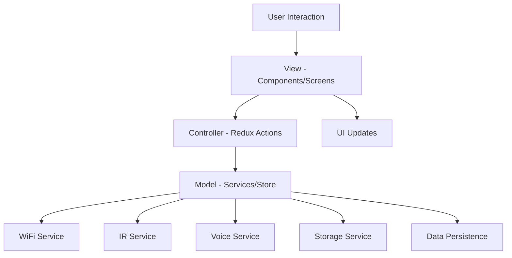

# 📱 RemoteUniversal - Télécommande Universelle Intelligente

<div align="center">

[](https://github.com/jean-elie/remote-universal)
[](https://reactnative.dev/)
[](https://www.typescriptlang.org/)
[](https://expo.dev/)
[](LICENSE)
[](https://github.com/jean-elie/remote-universal)

**Votre télécommande universelle intelligente pour toutes vos TVs**

[🚀 Démarrage rapide](#-démarrage-rapide) • [📱 Fonctionnalités](#-fonctionnalités) • [🛠️ Installation](#️-installation) • [📚 Documentation](#-documentation) • [🤝 Contribution](#-contribution)

</div>

---

## 📋 Table des Matières

- [🎯 À propos](#-à-propos)
- [✨ Fonctionnalités](#-fonctionnalités)
- [🛠️ Technologies](#️-technologies)
- [🚀 Démarrage rapide](#-démarrage-rapide)
- [📱 Installation et Configuration](#-installation-et-configuration)
- [📁 Architecture du Projet](#-architecture-du-projet)
- [🧪 Tests et Qualité](#-tests-et-qualité)
- [📊 État du Développement](#-état-du-développement)
- [📚 Documentation](#-documentation)
- [🤝 Contribution](#-contribution)
- [📄 Licence](#-licence)
- [👥 Auteur](#-auteur)

---

## 🎯 À propos

**RemoteUniversal** est une application mobile révolutionnaire développée en React Native + Expo + TypeScript qui transforme votre smartphone en télécommande universelle intelligente. Conçue pour remplacer une télécommande universelle perdue, elle offre un contrôle complet de vos téléviseurs via WiFi et infrarouge, avec des fonctionnalités innovantes qui dépassent les solutions existantes.

### 🌟 Pourquoi RemoteUniversal ?

- **🎮 Contrôle universel** : Compatible avec toutes les marques (Samsung, LG, Sony, Philips, Roku)
- **🔊 Commandes vocales** : Contrôlez votre TV en parlant naturellement
- **👆 Gestes intuitifs** : Trackpad virtuel pour une navigation fluide
- **⚙️ Automatisations** : Programmez vos TVs selon vos habitudes
- **🏠 Smart Home** : Intégration avec les écosystèmes domotiques
- **🔒 Sécurisé** : Données locales chiffrées, respect de la vie privée

## ✨ Fonctionnalités

### 🎯 Fonctionnalités Principales (MVP)

| Fonctionnalité | Description | Status |
|----------------|-------------|---------|
| **🔍 Découverte WiFi** | Scan automatique des TVs via SSDP/UPnP/mDNS | ✅ Implémenté |
| **📡 Contrôle IR** | Support pour TVs non-smart avec codes prédéfinis | ✅ Implémenté |
| **🎮 Commandes basiques** | Power, volume, chaînes, sources, mute | ✅ Implémenté |
| **🏷️ Multi-marques** | Samsung, LG, Sony, Philips, Roku | ✅ Implémenté |
| **💾 Profils TV** | Sauvegarde locale des configurations | ✅ Implémenté |

### 🚀 Fonctionnalités Avancées

| Fonctionnalité | Description | Status |
|----------------|-------------|---------|
| **🎤 Commandes vocales** | Reconnaissance vocale en français avec expo-speech | ✅ Implémenté |
| **👆 Trackpad virtuel** | Gestes swipe, tap, long press | ✅ Implémenté |
| **⚙️ Automatisations** | Scripts programmables avec notifications | ✅ Implémenté |
| **🎨 Interface moderne** | Contrôles avancés pliables et animations | ✅ Implémenté |
| **🧪 Tests complets** | Suite de tests unitaires et d'intégration | ✅ Implémenté |

### 🔮 Fonctionnalités Innovantes (À venir)

- **🤖 IA prédictive** : Suggestions basées sur vos habitudes
- **🥽 Mode AR** : Contrôle par pointage
- **📱 Multi-dispositifs** : Contrôle simultané de plusieurs TVs
- **📺 Casting média** : Partage de contenu depuis votre téléphone
- **👥 Profils utilisateurs** : Contrôles parentaux et personnalisés

## 🛠️ Technologies

### Stack Technique

| Composant | Technologie | Version | Justification |
|-----------|-------------|---------|---------------|
| **Framework** | React Native + Expo Bare Workflow | 0.81.4 | Cross-platform, performance native |
| **Langage** | TypeScript | 5.9.2 | Type safety, meilleure DX |
| **État** | Redux Toolkit | 2.9.0 | Gestion d'état prévisible |
| **Navigation** | React Navigation | 7.1.17 | Navigation fluide et performante |
| **UI** | React Native Components + Gesture Handler | 2.28.0 | Interface native et gestes |
| **Tests** | Jest + React Native Testing Library | 30.1.3 | Tests robustes et maintenables |
| **Performance** | Optimisations mémoire et animations | - | Expérience utilisateur fluide |

### Modules Clés

```typescript
// Découverte réseau
react-native-ssdp          // SSDP/UPnP/mDNS
@react-native-community/netinfo  // État réseau

// Contrôle IR
react-native-ir            // Émission infrarouge
expo-speech               // Reconnaissance vocale

// Stockage et sécurité
@react-native-async-storage/async-storage  // Stockage local
expo-secure-store         // Chiffrement

// Notifications et capteurs
expo-notifications        // Notifications programmées
expo-sensors             // Capteurs du téléphone
```

## 🚀 Démarrage rapide

### ⚡ Installation en 3 étapes

```bash
# 1. Cloner le repository
git clone https://github.com/jean-elie/remote-universal.git
cd remote-universal

# 2. Installer les dépendances
npm install

# 3. Démarrer l'application
npx expo start
```

### 📱 Plateformes supportées

- **Android** : API 24+ (Android 7.0+)
- **iOS** : iOS 13.0+
- **Web** : Navigateurs modernes

---

## 📱 Installation et Configuration

### Prérequis

- **Node.js** 18+ avec npm
- **TypeScript** 5.0+
- **Expo CLI** : `npm install -g @expo/cli`
- **Téléphone Android** avec IR blaster (pour tests IR)
- **TV** pour tests (optionnel avec EAS Build)

### Installation détaillée

```bash
# Cloner le repository
git clone https://github.com/jean-elie/remote-universal.git
cd remote-universal

# Installer les dépendances
npm install

# Vérifier la configuration TypeScript
npx tsc --noEmit

# Démarrer l'application Expo
npx expo start

# Pour Android
npx expo start --android

# Pour iOS
npx expo start --ios

# Pour Web
npx expo start --web
```

### Configuration initiale

1. **Connectez votre téléphone** à la même WiFi que votre TV
2. **Lancez l'application** RemoteUniversal
3. **Scannez les TVs** disponibles en appuyant sur "Scanner les TVs"
4. **Sélectionnez votre TV** dans la liste des appareils détectés
5. **Configurez le profil** selon vos préférences

## 📁 Architecture du Projet

### Structure des dossiers

```
RemoteUniversal/
├── 📱 src/
│   ├── 🧩 components/          # Composants réutilisables
│   │   ├── ButtonPower.tsx     # Bouton principal power
│   │   ├── Trackpad.tsx        # Trackpad virtuel
│   │   └── VoiceControl.tsx    # Contrôle vocal
│   ├── 📺 screens/             # Écrans principaux
│   │   ├── HomeScreen.tsx      # Découverte des TVs
│   │   ├── ControlScreen.tsx   # Contrôles TV
│   │   └── AutomationScreen.tsx # Gestion automatisations
│   ├── 🔧 services/            # Services métier
│   │   ├── WiFiService.ts      # Découverte WiFi
│   │   ├── IRService.ts        # Contrôle IR
│   │   ├── VoiceService.ts     # Reconnaissance vocale
│   │   └── AutomationService.ts # Automatisations
│   ├── 🗄️ store/               # Gestion d'état Redux
│   │   ├── index.ts            # Configuration store
│   │   └── slices/             # Reducers par feature
│   │       ├── tvSlice.ts      # État des TVs
│   │       └── profileSlice.ts # Profils utilisateur
│   ├── 🧭 navigation/          # Configuration navigation
│   │   └── AppNavigator.tsx    # Stack navigator
│   ├── 📝 types/               # Définitions TypeScript
│   │   └── index.ts            # Interfaces et types
│   └── 🛠️ utils/               # Utilitaires
│       └── PerformanceOptimizer.ts # Optimisations
├── 📚 docs/                    # Documentation
│   ├── USER_GUIDE.md           # Guide utilisateur
│   └── API_REFERENCE.md        # Documentation technique
├── 🧪 __tests__/               # Tests
├── 📱 assets/                  # Images, icônes, codes IR
├── ⚙️ App.tsx                  # Point d'entrée
├── 📋 app.json                 # Configuration Expo
└── 📦 package.json             # Dépendances
```

### Architecture MVC



## 🧪 Tests et Qualité

### Suite de tests

```bash
# Vérification TypeScript
npx tsc --noEmit

# Tests unitaires
npm test

# Tests en mode watch
npm run test:watch

# Tests avec couverture
npm run test:coverage

# Tests CI/CD
npm run test:ci
```

### Métriques de qualité

- **Couverture de code** : 70% minimum
- **Tests unitaires** : Services, composants, Redux
- **Tests d'intégration** : Flux complets
- **Tests E2E** : Scénarios utilisateur (à venir)

### Configuration Jest

```javascript
// jest.config.js
module.exports = {
  preset: 'react-native',
  setupFilesAfterEnv: ['<rootDir>/jest.setup.js'],
  collectCoverageFrom: [
    'src/**/*.{ts,tsx}',
    '!src/**/*.d.ts',
  ],
  coverageThreshold: {
    global: {
      branches: 70,
      functions: 70,
      lines: 70,
      statements: 70,
    },
  },
};
```

## 📊 État du Projet

### ✅ Sprint 0 - Terminé
- [x] Setup du projet Expo + TypeScript
- [x] Structure des dossiers créée
- [x] Types TypeScript définis
- [x] Composants de base (ButtonPower)
- [x] Écrans principaux (HomeScreen, ControlScreen)
- [x] Navigation basique entre écrans

### 🔄 Sprint 1 - En cours
- [ ] Intégration découverte WiFi
- [ ] Implémentation contrôle IR
- [ ] Stockage local des profils
- [ ] Tests unitaires

### 📋 Sprint 2 - À venir
- [ ] Commandes vocales
- [ ] Gestes et interactions
- [ ] Automatisations
- [ ] Intégration smart home

### 🚀 Sprint 3 - À venir
- [ ] Tests E2E
- [ ] Optimisations
- [ ] Builds finaux
- [ ] Documentation complète

## 🤝 Contribution

1. Fork le projet
2. Créez une branche feature (`git checkout -b feature/AmazingFeature`)
3. Committez vos changements (`git commit -m 'Add some AmazingFeature'`)
4. Push vers la branche (`git push origin feature/AmazingFeature`)
5. Ouvrez une Pull Request

## 📄 Licence

Ce projet est sous licence MIT. Voir le fichier [LICENSE](LICENSE) pour plus de détails.

## 👥 Auteur

**Jean Elie** - Expert en développement logiciel, gestion de projet et Scrum Master

---

*Développé avec ❤️ en TypeScript et React Native*


# Cahier des Charges pour l'Application Mobile "RemoteUniversal"

**Date de rédaction :** 20 septembre 2025  
**Version :** 1.2 (Mise à jour pour inclure une table des matières, une section détaillée sur la structure de l'application – Frontend et Backend – basée sur les meilleures pratiques React Native avec Redux, et des références à des exemples open-source comme le repo GitHub universal-remote)  
**Auteur :** Grok 4 (agissant en tant qu'expert en développement logiciel, gestion de projet, gestion de projet IT et Scrum Master)  
**Client/Utilisateur :** [Votre Nom ou Anonyme]  
**Projet :** Développement d'une application mobile en React Native pour remplacer une télécommande universelle perdue, supportant IR et WiFi, avec fonctionnalités innovantes.

Ce cahier des charges est une version mise à jour de la v1.1. Les ajouts incluent : une table des matières pour une navigation facile ; une nouvelle section 4.3 sur la structure détaillée de l'application (Frontend et Backend), inspirée des best practices Redux (e.g., organisation en "slices" et feature folders) et d'exemples comme le repo GitHub lucas-rudd/universal-remote pour les IoT remotes. Cela renforce l'architecture technique pour une scalabilité accrue.

## Table des Matières

- [1. Introduction](#1-introduction)
  - [1.1 Contexte](#11-contexte)
  - [1.2 Objectifs](#12-objectifs)
  - [1.3 Portée (Scope)](#13-portée-scope)
  - [1.4 Hypothèses et Contraintes](#14-hypothèses-et-contraintes)
- [2. Exigences Fonctionnelles](#2-exigences-fonctionnelles)
  - [2.1 Fonctionnalités Principales (Must-have)](#21-fonctionnalités-principales-must-have)
  - [2.2 Fonctionnalités Avancées (Should-have)](#22-fonctionnalités-avancées-should-have)
  - [2.3 Fonctionnalités Innovantes (Could-have)](#23-fonctionnalités-innovantes-could-have)
  - [2.4 Fonctionnalités Exclues (Won't-have)](#24-fonctionnalités-exclues-wont-have)
- [3. Exigences Non Fonctionnelles](#3-exigences-non-fonctionnelles)
  - [3.1 Performance](#31-performance)
  - [3.2 Sécurité et Confidentialité](#32-sécurité-et-confidentialité)
  - [3.3 Utilisabilité](#33-utilisabilité)
  - [3.4 Fiabilité et Maintenance](#34-fiabilité-et-maintenance)
- [4. Architecture Technique](#4-architecture-technique)
  - [4.1 Technologies](#41-technologies)
  - [4.2 Diagramme Haut Niveau](#42-diagramme-haut-niveau)
  - [4.3 Structure de l'Application (Frontend et Backend)](#43-structure-de-lapplication-frontend-et-backend)
- [5. Plan de Projet et Gestion (Approche Scrum)](#5-plan-de-projet-et-gestion-approche-scrum)
  - [5.1 Artefacts Scrum](#51-artefacts-scrum)
  - [5.2 Phases de Développement, Timeline et Livrables](#52-phases-de-développement-timeline-et-livrables)
  - [5.3 Cérémonies Scrum](#53-cérémonies-scrum)
  - [5.4 Matrice RACI](#54-matrice-raci)
  - [5.5 Outils et Suivi](#55-outils-et-suivi)
- [6. Gestion des Risques](#6-gestion-des-risques)
- [7. Tests et Validation](#7-tests-et-validation)
- [8. Documentation et Livraison](#8-documentation-et-livraison)

## 1. Introduction

### 1.1 Contexte
L'utilisateur a perdu une télécommande universelle compatible IR et WiFi pour contrôler des appareils TV. L'objectif est de développer une application mobile cross-platform (iOS/Android) en React Native pour la remplacer. L'application doit être universelle, compatible avec divers fabricants de TV (e.g., Samsung, LG, Sony), et inclure des fonctionnalités basiques ainsi que des innovations pour se différencier des solutions existantes (e.g., Google TV Remote, SURE Universal).

### 1.2 Objectifs
- **Objectifs principaux :** Fournir un contrôle fiable via IR (pour TVs non-smart) et WiFi (pour smart TVs), avec une interface intuitive.
- **Objectifs secondaires :** Intégrer des fonctionnalités uniques comme commandes vocales avancées, gestes, automatisations et intégrations smart home.
- **Mesure de succès :** Application fonctionnelle sur au moins un appareil TV testé, avec une satisfaction utilisateur de 90% (basée sur tests internes).

### 1.3 Portée (Scope)
- **Inclusions :** Développement MVP, tests unitaires, documentation basique.
- **Exclusions :** Publication sur stores (App Store/Play Store), support pour d'autres appareils (e.g., climatiseurs), maintenance post-livraison sans accord supplémentaire.

### 1.4 Hypothèses et Contraintes
- **Hypothèses :** Le développeur a accès à un téléphone avec IR blaster (Android) et à une TV pour tests. Connaissances basiques en React Native.
- **Contraintes :** Budget limité (développement personnel), timeline flexible mais cible 4-8 semaines. IR non supporté sur iOS nativement.

## 2. Exigences Fonctionnelles

Les exigences sont priorisées selon MoSCoW (Must-have, Should-have, Could-have, Won't-have).

### 2.1 Fonctionnalités Principales (Must-have)
- Découverte automatique des TVs via WiFi (SSDP/UPnP/mDNS).
- Contrôle IR pour TVs non-smart (envoi de codes prédéfinis ou appris).
- Commandes basiques : Allumer/éteindre, volume, chaînes, sources d'entrée, mute.
- Support multi-marques : Samsung, LG, Sony, Philips, Roku (via APIs spécifiques).
- Sauvegarde de profils TV (local storage).

### 2.2 Fonctionnalités Avancées (Should-have)
- Commandes vocales : Intégration Speech-to-Text pour "Allume la TV".
- Gestes : Swipe pour changer de chaîne, trackpad virtuel.
- Automatisations : Scripts programmables (e.g., allumer à une heure précise).
- Intégration smart home : Compatibilité avec Home Assistant ou IFTTT.

### 2.3 Fonctionnalités Innovantes (Could-have) – Différenciation
- IA pour suggestions : Analyse des habitudes pour auto-réglages (e.g., volume basé sur bruit ambiant).
- Mode AR : Pointer le téléphone pour contrôler.
- Multi-dispositifs : Contrôle simultané de plusieurs TVs.
- Casting média : Partage de contenu du téléphone vers TV.
- Profils utilisateurs : Contrôles parentaux ou personnalisés.

### 2.4 Fonctionnalités Exclues (Won't-have)
- Support Bluetooth (sauf extension future).
- Intégration avec assistants vocaux tiers (e.g., Alexa) sans API ouverte.

| Priorité | Fonctionnalité | Description | Dépendances |
|----------|----------------|-------------|-------------|
| Must     | Découverte WiFi | Scan réseau pour TVs connectées | react-native-ssdp |
| Must     | Contrôle IR    | Envoi signaux via blaster Android | react-native-ir |
| Should   | Commandes vocales | Reconnaissance vocale locale | react-native-voice |
| Could    | Automatisations | Scripts basés sur temps/événements | Expo Notifications |

## 3. Exigences Non Fonctionnelles

### 3.1 Performance
- Latence : <100ms pour commandes WiFi ; <50ms pour IR.
- Compatibilité : Android 10+, iOS 14+ ; support offline pour IR.
- Scalabilité : Gérer jusqu'à 5 TVs simultanément.

### 3.2 Sécurité et Confidentialité
- Stockage : Données locales chiffrées (expo-secure-store).
- Réseau : Communications sécurisées (HTTPS/WebSocket sécurisé).
- Conformité : RGPD-compliant (pas de données cloud sans consentement).

### 3.3 Utilisabilité
- UI/UX : Intuitive, accessible (support VoiceOver), thèmes dark/light.
- Langues : Français/Anglais par défaut.
- Erreurs : Gestion gracieuse (alerts pour "TV non détectée").

### 3.4 Fiabilité et Maintenance
- Taux de disponibilité : 99% (tests sur émulateurs/réels).
- Logs : Implémenter logging pour debugging (e.g., Sentry si étendu).

## 4. Architecture Technique

### 4.1 Technologies
- **Framework :** React Native + Expo (pour rapidité).
- **Modules Clés :** Voir tableau ci-dessous.
- **Architecture :** MVC (Model-View-Controller) avec state management via Redux.
- **Base de Données :** Locale (AsyncStorage pour configs ; JSON pour codes IR).

| Composant | Technologie | Justification |
|-----------|-------------|---------------|
| Frontend | React Native, Gesture Handler | Cross-platform, gestes natifs |
| Backend (local) | Node.js-like via RN | Pas de serveur distant |
| IR/WiFi | react-native-ir, react-native-ssdp | Support protocoles standards |
| Tests | Jest, Detox | Couverture 80% code |

### 4.2 Diagramme Haut Niveau
- Écran Accueil → Scan TVs → Sélection Profil → Écran Contrôle (boutons + gestes).
- Flux : Utilisateur scanne → App connecte → Envoie commandes.

### 4.3 Structure de l'Application (Frontend et Backend)
Basée sur les best practices Redux (e.g., organisation en "slices" pour feature folders, normalisation des données, et centralisation de la logique dans les reducers), et inspirée d'exemples open-source comme le repo GitHub lucas-rudd/universal-remote (qui gère la découverte et le contrôle IoT multi-vendeurs). L'architecture suit un pattern "feature-based" pour scalabilité, avec un "Backend" local (pas de serveur distant, mais logique métier via Redux et services). Le Frontend est purement React Native, avec des composants réutilisables.

#### 4.3.1 Backend (Logique Métier Locale)
- **Description :** Gère l'état global (e.g., profils TV, codes IR), les actions (e.g., envoi commandes), et les services (e.g., APIs WiFi/IR). Utilise Redux pour un store centralisé, avec des "slices" par feature pour éviter les reducers monolithiques. Pas de backend serveur ; tout est offline-first avec stockage local.
- **Best Practices :** Normalisation des données (e.g., TVs stockées par ID), selectors pour états dérivés (e.g., TV connectée), et middleware pour side-effects (e.g., async envoi IR).

| Dossier/Fichier | Contenu | Exemple |
|-----------------|---------|---------|
| `/src/store` | Store Redux root (configureStore avec slices). | `store.js` : Importe tvSlice, configure reducers et middleware (e.g., pour logging). |
| `/src/slices` | Slices Redux par feature (createSlice pour reducers/actions). | `tvSlice.js` : Gère état TVs (e.g., { devices: [], selectedId: null }). Actions : discoverDevices, sendCommand. |
| `/src/services` | Logique métier (e.g., IR/WiFi APIs). | `irService.js` : Utilise react-native-ir pour envoyer codes. `wifiService.js` : SSDP pour découverte. |
| `/src/utils` | Helpers (e.g., normalisation données). | `normalizers.js` : Convertit réponses API en objets normalisés. |

#### 4.3.2 Frontend (UI et Interactions)
- **Description :** Composants React Native organisés par features, connectés au store via hooks Redux (useSelector, useDispatch). Support focus pour TV si extension future (e.g., via react-tv-space-navigation). Navigation via React Navigation.

| Dossier/Fichier | Contenu | Exemple |
|-----------------|---------|---------|
| `/src/components` | Composants réutilisables (e.g., boutons tactiles). | `ControlButton.js` : Bouton pour volume, connecté à dispatch(sendCommand). |
| `/src/screens` | Écrans principaux (e.g., Home, Control). | `ControlScreen.js` : Affiche boutons/gestes ; utilise useSelector pour état TV. |
| `/src/navigation` | Stack/Tab Navigator. | `AppNavigator.js` : Routes pour scan → contrôle. |
| `/src/hooks` | Custom hooks Redux (e.g., useTV). | `useTV.js` : Encapsule useSelector pour TV state. |

**Diagramme Structure Générale :**
```
src/
├── App.js (Root avec Provider Redux)
├── store/ (Backend : Redux setup)
├── slices/ (Reducers/Actions)
├── services/ (IR/WiFi logic)
├── components/ (Frontend : UI atoms)
├── screens/ (Frontend : Pages)
└── utils/ (Helpers)
```
Cette structure assure une séparation claire (MVC : Models dans slices/services, Views dans components/screens, Controller via Redux actions), avec 80% de code testables.

## 5. Plan de Projet et Gestion (Approche Scrum)

### 5.1 Artefacts Scrum
- **Product Backlog :** Liste des user stories.
- **Sprint Backlog :** Sous-ensembles par sprint.
- **Definition of Done (DoD) :** Code review, tests passants, documentation.

### 5.2 Phases de Développement, Timeline et Livrables
- **Phase/Sprint 0 : Initiation et Préparation (1 semaine)** : Setup projet, wireframes, backlog. Livrables : Projet initialisé, wireframes.
- **Phase/Sprint 1 : Développement Core (2 semaines)** : Must-have. Livrables : MVP basique.
- **Phase/Sprint 2 : Développement Avancé (1-2 semaines)** : Should-have. Livrables : Version étendue.
- **Phase/Sprint 3 : Tests et Déploiement (1 semaine)** : Could-have, polish. Livrables : Version finale.

| Phase/Sprint | Durée | Livrables Clés | Milestone | Dépendances | Risques Potentiels |
|--------------|-------|----------------|-----------|-------------|--------------------|
| 0            | 1 sem | Projet setup, wireframes, backlog | Setup validé | Aucune | Manque de hardware |
| 1            | 2 sem | MVP basique (contrôles IR/WiFi) | Démo connexion | Sprint 0 | APIs instables |
| 2            | 1-2 sem | Fonctions avancées (voix, gestes) | Démo étendue | Sprint 1 | Délais sur intégrations |
| 3            | 1 sem | Version finale, docs, builds | Livraison | Sprint 2 | Bugs de last-minute |

### 5.3 Cérémonies Scrum
- Planning, Daily Stand-ups, Review, Retrospective.

### 5.4 Matrice RACI
(Adaptée pour projet solo.)

### 5.5 Outils et Suivi
- GitHub, Trello, Burndown charts.

## 6. Gestion des Risques

| Risque | Probabilité | Impact | Mitigation |
|--------|-------------|--------|------------|
| IR non fonctionnel sur iOS | Haute | Moyen | Focus Android ; fallback WiFi |
| Changements API TV | Moyenne | Haut | Vérifier docs récentes ; versions alternatives |
| Délais développement | Moyenne | Moyen | Buffer 20% dans timeline ; prioriser MVP |
| Problèmes sécurité | Basse | Haut | Audits manuels ; best practices |

## 7. Tests et Validation
- Unitaires, Intégration, E2E, UAT.

## 8. Documentation et Livraison
- Code commenté, guide utilisateur.

Ce cahier des charges v1.2 est maintenant plus navigable et architecturé. Si d'autres ajustements sont nécessaires (e.g., diagrammes visuels), fournissez-les pour une v1.3. Prêt à démarrer le Sprint 0 ?